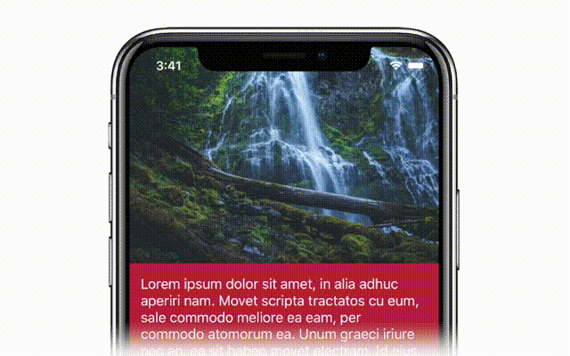
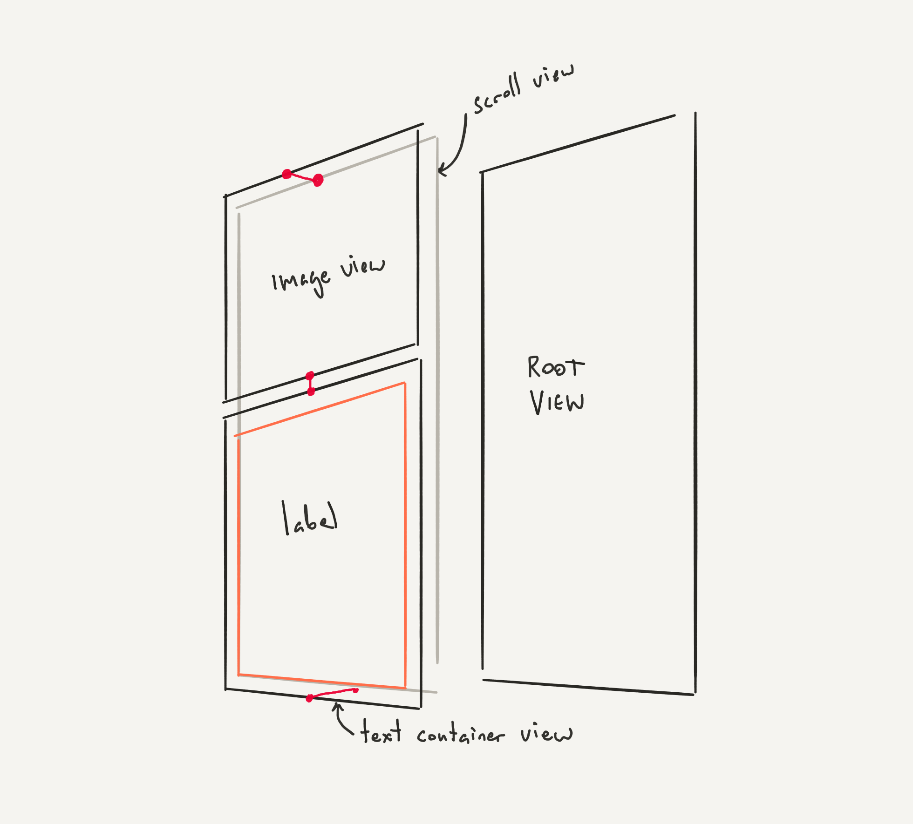
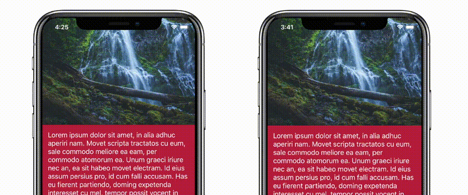
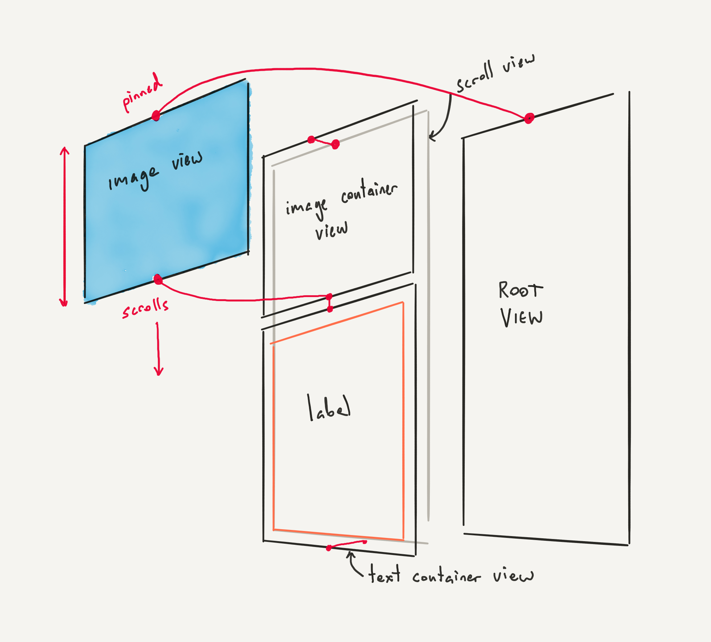

# Stretchy Layouts on iOS Using Auto Layout

Check the image below. This is a cool effect.



And it's really easy to build in iOS using Auto Layout. I want to
write about this because the effect is so simple, and Auto Layout
makes its implementation so elegant, that I think you ought to know
about it.

If you want to follow along you can [clone the demo project at our
starting point](https://github.com/TwoLivesLeft/StretchyLayout/tree/Step-1)
then implement this effect as you read along. You'll need Xcode 9 as we're
going all-in on iOS 11 for this example.

```
git clone https://github.com/TwoLivesLeft/StretchyLayout.git
cd StretchyLayouts
git checkout Initial-App
```

Here's how we'll do this

* Start with the basic non-stretchy app
* We will modify the view hierarchy and add the necessary constraints to
make it stretchy
* Then we'll follow a few more steps to add polish to the app

## The non-Stretchy App



Here's the view hierarchy for the basic version of the app. You can see it has
three views. The header `UIImageView`, the red backing behind the text, and the
long `UILabel` containing our text content.

We're going to build this using an Auto Layout framework called
[SnapKit](http://snapkit.io). SnapKit is a simple iOS framework that makes
Apple's Auto Layout API ... sane. It's dead simple to use and makes
programming with Auto Layout genuinely pleasurable.

Most of the code will live in `viewDidLoad` of our
`StretchyViewController.swift` class. Below you can see how the initial
constraints are set.

Our views are declared as private members:

```
private let scrollView = UIScrollView()
private let infoText = UILabel()
private let imageView = UIImageView()
```

And our view controller's view has a scroll view as its first subview, followed
by the text and image views (as well as a backing view which provides us with
the red background behind the text).

```
//Pin the edges of the scroll view to
// our view controller's view
scrollView.snp.makeConstraints {
    make in

    make.edges.equalTo(view)
}

//Pin the top of our image view to the scroll view
// pin the left and right to the view controller's view
// give it an aspect ratio constraint by constraining
//  its height to its width with a multiplier
imageView.snp.makeConstraints {
    make in

    make.top.equalTo(scrollView)
    make.left.right.equalTo(view)
    make.height.equalTo(imageView.snp.width).multipliedBy(0.7)
}

//Pin the backing view below the image view and to the
// bottom of the scroll view
backing.snp.makeConstraints {
    make in

    make.top.equalTo(imageView.snp.bottom)
    make.left.right.equalTo(view)
    make.bottom.equalTo(scrollView)
}

//Pin the edges of the text to the backing view, this
// will force the backing view to grow to encompass the
// text's height
infoText.snp.makeConstraints {
    make in

    make.edges.equalTo(backing).inset(14)
}
```

> Note: To get the code at this point do `git checkout Initial-App`

## A Brief Aside

You notice we used SnapKit above. SnapKit is great; here's a primer on
how it works.

You access the `snp` member object on any `UIView`.

You call `makeConstraints` which accepts a closure, the closure is given a
`ConstraintMaker` object (called `make` here).

You then use the `make` object to pin edges or anchors of one view to any
other view, layout guide, or constant.

```
myView.snp.makeConstraints {
    make in

    make.edges.equalTo(view)
}
```

This will pin the edges of `myView` to the edges of `view`.

It's readable and concise. *Use this instead of the default Auto Layout API.*

## Making it Stretchy

So how do we go from this, to this?



Important to this effect is that Auto Layout will solve constraints
regardless of whether your views are siblings or elsewhere in the hierarchy.
As long as they have a common ancestor.

But key is that views within scroll views can be constrained to views
outside of scroll views. That's how we will make this work.



In the above diagram the bright red lines represent our constraints. Note how
the top of the image view is now pinned all the way back — outside the scroll
view — to the top of the root view. But its bottom is pinned to the bottom of
the image container view, which *is* inside the scroll view. This means that
when the scroll view scrolls, our image view will stretch to satisfy its
constraints.

So for our first step we'll replace our `UIImageView` with an empty container
view.

```
let imageContainer = UIView()
imageContainer.backgroundColor = .darkGray
scrollView.addSubview(imageContainer)

imageContainer.snp.makeConstraints {
    make in

    make.top.equalTo(scrollView)
    make.left.right.equalTo(view)
    make.height.equalTo(imageContainer.snp.width).multipliedBy(0.7)
}
```

Then we'll add our image view as a subview of our scroll view. But we're going
to pin its top edge to our *view's* top edge — not our scroll view's top (the
container we just added above is pinned to our scroll view's top edge).

```
scrollView.addSubview(imageView)

imageView.snp.makeConstraints {
    make in

    make.left.right.equalTo(view)

    //** These are the key lines! **
    make.top.equalTo(view)
    make.bottom.equalTo(backing.snp.top)
}
```

Above you can see the lines that make this work. Our image container view
scrolls exactly how the original non-stretchy app scrolled. But we've added
our actual image view above that container, and then we've pinned its bottom
to the container bottom, but its **top** is pinned to the view controller's
view.

This means that when you drag down in the scroll view the top of the image
"sticks" to the top of the screen and the whole image just gets bigger. And
because we're using:

`imageView.contentMode = .scaleAspectFill`

We're going to see the image content scale up within the image view as we
over-scroll the scroll view.

> Note: To get the code at this point do `git checkout Basic-Stretchy-Layout`

### But there's a bug

If you run this code, dragging down on the screen with your finger produces
the desired effect: the image scales up and bounces back. But if you scroll up
to read the text ... well, you'll realise that you can't.

Why?

Because when we scroll up we are compressing the `UIImageView` into a
zero-height line. Its top *must* be equal to the view's top, and its bottom
*must* be equal to the text backing view's top. So this means the scroll view
will continue to "scroll," but we won't see the changes because the backing
view is jammed up against the image view, which is refusing to move above the
top of the root view despite the scroll view scrolling.

Auto Layout is technically solving our constraints, but it's not what we want.

### Fixing the bug

We have to change how we constrain the image view. Here's the change:

```
imageView.snp.makeConstraints {
    make in

    make.left.right.equalTo(view)

    //Note the priorities
    make.top.equalTo(view).priority(.medium)
    make.height.greaterThanOrEqualTo(imageContainer.snp.height).priority(.high)

    make.bottom.equalTo(backing.snp.top)
}
```

Notice that we now have a top constraint, a bottom constraint, *and* a height
constraint? This is one of the awesome things about Auto Layout: we can have
conflicting constraints and they will be broken in priority order.
This is necessary to achieve the effect we want.

First we keep our original constraint: the top of our image view is pinned to
the top of our view. We give this a priority of `.medium`.

Then we add an additional constraint: the height of our image must be greater
than or equal to the height of the image container behind it (recall our image
container has the aspect ratio constraint). This has a `.high` priority.

So what happens when we scroll up?

Well, the image *can't* get smaller. Our height constraint has a higher priority
than the top constraint. So when we scroll up Auto Layout will break the
lowest priority constraint in order to solve the system. It will break the top
constraint and our scrolling behaviour will revert to normal, allowing us
to scroll up and read the text.

> Note: To get the code at this point do `git checkout Fixing-The-Bug`

## Polishing the Details

There's three more jarring problems we should fix while we're here.

First, if we over-scroll past the bottom of the view we get to see the ugly
grey background of our view controller. We can use the exact same method to
stretch our backing view out when we over-scroll past the bottom of the view.

[Before after over-scroll]

Second, on iPhone X our text overlaps the home indicator. We disabled the
automatic content inset adjustment of our scroll view in order to let our image
content go right to the top of the screen. So we'll have to manually handle
the bottom inset using the new `safeAreaInsets` property in iOS 11.

[Before after text home indicator]

Second part (b), we also want to use `safeAreaInsets` to adjust our scroll
view's scrolling indicators so they don't run into the curved edges of the
screen on iPhone X.

[Before after scroll indicator]

And third, let's hide the status bar with a cool animation when the user
scrolls the text into the status bar area. It's quite easy to detect this and
I think the effect looks great.

[Animated GIF status bar hide]

> Note: To get the code at this point do `git checkout Step-7`

## What We Covered

* You can pin pretty much anything to anything else and your views will
stretch to satisfy your constraints
* Even if you're scrolling
* Constraints are broken in priority order, so don't be afraid to experiment
with conflicting constraints
* Use SnapKit
